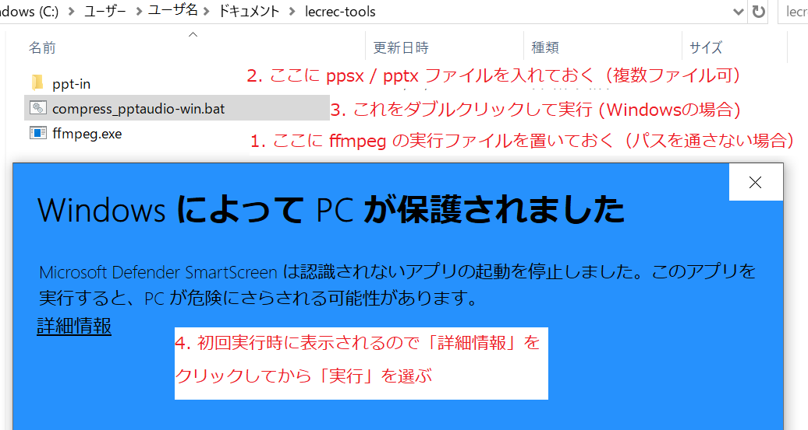

[(English)](README-en.md)

# 音声付きパワーポイントスライドの圧縮

PowerPointで録音されるオーディオファイルは「音声」としてはビットレートが高いため、どうしてもサイズが大きくなります．このツールは内部のオーディオデータのビットレートを下げて，pptx/ppsxのファイルサイズを小さくします．「挿入 > オーディオ > オーディオの録音」で作成された音声付きパワーポイントを想定しています。

- 内部に含まれる m4a の音声ファイルのビットレートを64kbpsに圧縮します。
- 画像や動画は圧縮しません（それぞれ「書式/図の形式 > 図の圧縮」や「ファイル > 情報 > メディアの圧縮」などを別途利用できます）。

## インストール

1. 適当なフォルダ（`lecrec-tools`とします）を作成し、中に`ppt-in`というフォルダを作成します。さらに、以下をダウンロードして置いておきます（右クリック > 名前を付けてリンク先を保存）。
   - Windows: [compress_pptaudio-win.bat](https://github.com/hkawash/lecrec-tools/raw/master/compress_pptaudio-win.bat)
   - Mac/Linux: [compress_pptaudio-mac.sh](https://github.com/hkawash/lecrec-tools/raw/master/compress_pptaudio-mac.sh)
   - 別の簡単な方法として、[このプロジェクト(lecrec-tools)のzip](https://github.com/hkawash/lecrec-tools/archive/master.zip)をダウンロードし、zipを展開してもよいです。
2. ffmpeg を[こちらのサイト](https://ffmpeg.zeranoe.com/builds/)からダウンロードして展開します。
   - Version はリリース版（4.2.2など）でよいです。
   - Architecture でOSを選びます。
   - Linking は Static のままとしておきます。
   - ダウンロードサイトは[ffmpeg の元サイト](https://www.ffmpeg.org/download.html)からたどってもよいです。
3. 展開してできたフォルダをたどり、bin というフォルダの下にある ffmpeg.exe (Macはffmpeg) を、1で作成（もしくは展開）したフォルダの中に入れておきます。

すでに ffmpeg をインストール済みの場合、2, 3のステップは不要です。環境変数でパスを設定していないならば .bat や .sh 内の `PATH` を編集してパスを通しておきます。面倒な場合は 3のステップのようにファイルをコピーしておきます。

## 使い方

1. 音声付きpptxもしくはppsxファイルを`ppt-in`フォルダに入れておきます。
   - 複数のファイルを入れてもOKです。
   - 念のため pptxやppsxはバックアップを取っておいてください。
2. スクリプトを実行します（<a href="#note1">実行時の注意点</a>も参考にしてください）。
   - Windows: `compress_pptaudio-win.bat` をダブルクリックします。
   - Mac (Linux, Windowsのbash): ターミナルを開いて `compress_pptaudio-mac.sh` を実行します。
   
3. `ppt-out`フォルダに、圧縮された pptx や ppsx ファイルが出力されます。


<a name="note1"></a>

### 実行時の注意点

#### Windows

- **ダウンロードしてから初めて実行するときは、「WindowsによってPCが保護されました」と表示されるので、「詳細情報」をクリックしてから「実行」を選んでください。**
- 黒い画面が開きますが、勝手に閉じるまで待ってください。
- 同時に何回も実行しないでください。

#### Mac (および Linux や Windowsのbash)

1. bash の使えるターミナルを開きます。Macは Launchpad や Spotlightで、ter.. ぐらいを打ち込むとターミナルを選べます。）
1. スクリプトのあるフォルダへ移動します。Macで、[書類] の下に `lecrec-tools` というフォルダで展開したのであれば、以下を打ち込んでフォルダを移動します。
    ```
    cd /Users/<ユーザ名>/Documents/lecrec-tools
    ```
    （上のコマンドを打ち込んだあと、最後に return を押します。途中でtabキーを押すとファイル名などが補完できます。`<ユーザ名>`のところには、PCで使っている自分のユーザ名を入れます。）
1. ターミナルで以下を打ち込んで return キーを押し、スクリプトを実行します。
    ```
    ./compress_pptaudio-mac.sh
    ```
   （この前に `chmod 755 compress_pptaudio-mac.sh` が必要かもしれません。）

### その他

- このスクリプトでは、内部の m4a ファイルを 64kbps にします。これ以外のビットレートにするには、スクリプト内の `BITRATE` を変更してください。
- m4a 以外のオーディオファイルが挿入されていて、これを圧縮対象とするには、スクリプト内の `m4a` のあたりを変更してください。
